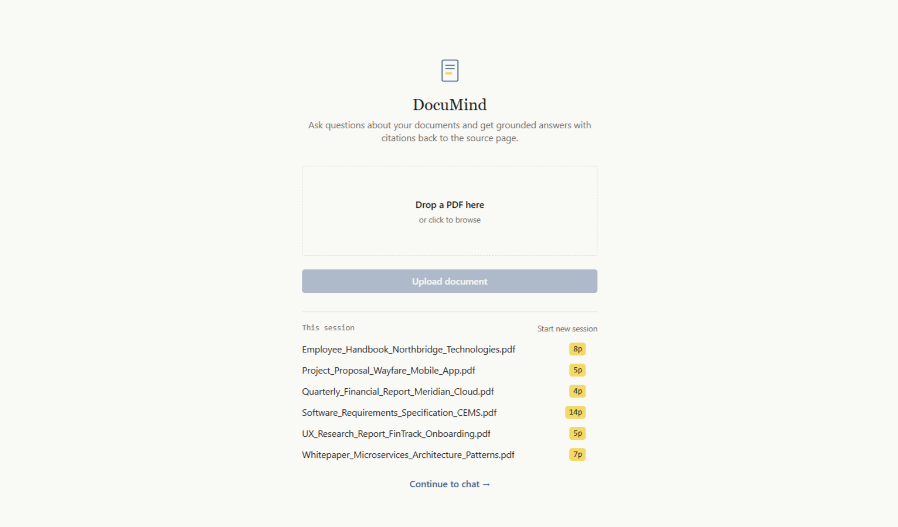
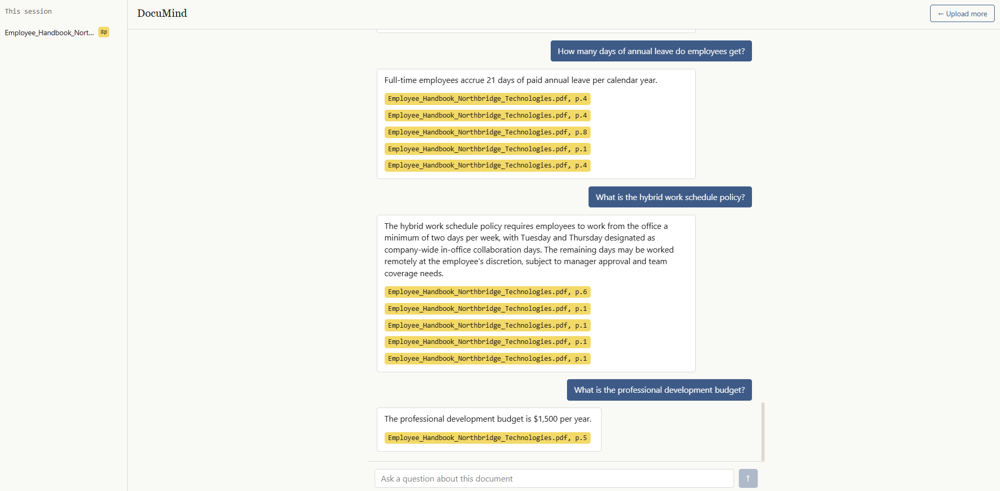
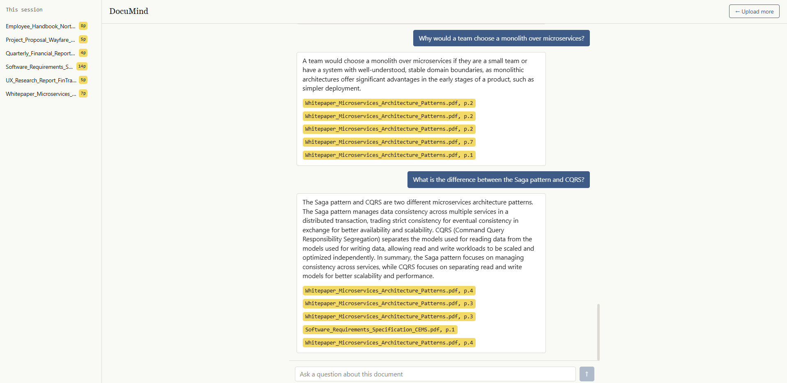

# DocuMind

A retrieval-augmented generation (RAG) system for asking natural-language questions about uploaded documents. Users upload one or more PDFs into a session and ask questions against them, receiving answers grounded in the source material with citations to the specific document and page each answer is based on.

## Overview

Sending a full document to a general-purpose LLM chat interface has practical limits: context windows cap how much text can be included, repeated large-context requests are slow and expensive, and there is no reliable way to verify which part of a document an answer came from. DocuMind addresses this with a standard RAG architecture — retrieving only the relevant sections of a document set for each question, rather than processing the entire document on every request.

The retrieval, chunking, and generation pipeline is implemented directly against the underlying libraries (pdfplumber, sentence-transformers, Chroma, Groq) rather than through a higher-level RAG framework such as LangChain. This keeps each stage of the pipeline visible and independently testable.

## Screenshots

**Upload screen** — upload one or more PDFs into a session.


**Chat screen** — ask questions and receive grounded answers with citations.


**Multi-document session** — questions can span several uploaded documents, with citations attributing each fact to the correct source.


## Architecture

```
User (browser)
      |
      v
React frontend (Vite + Tailwind)
      |  upload / ask
      v
FastAPI backend
      |
      +-- pdfplumber              text extraction, per page
      +-- chunking service        splits text into overlapping chunks
      +-- sentence-transformers   embeds chunks locally
      +-- Chroma                  vector store, one collection per session
      +-- MongoDB                 document metadata and conversation history
      +-- Groq (Llama 3.3)        generates answers from retrieved chunks
```

**Pipeline:** an uploaded PDF is parsed page by page, split into overlapping ~500-character chunks, and each chunk is embedded and stored in a Chroma collection scoped to the session, tagged with its source document and page number. A user's question is embedded using the same model, the most relevant chunks are retrieved and filtered by a distance threshold (rather than returning a fixed number regardless of relevance), and the filtered chunks are passed to Groq along with the question to generate an answer. The response includes citations linking back to the specific chunks used.

## Tech stack

| Layer | Technology | Notes |
|---|---|---|
| Frontend | React, Vite, Tailwind CSS | |
| Backend | FastAPI | Async Python web framework |
| PDF parsing | pdfplumber | |
| Embeddings | sentence-transformers (`all-MiniLM-L6-v2`) | Runs locally; 384-dimensional vectors |
| Vector store | Chroma | Local, session-scoped collections |
| Structured storage | MongoDB | Document metadata, conversation history |
| LLM | Groq API (Llama 3.3 70B) | Used for answer generation only |
| Testing | pytest | Unit and integration tests |

## Features

- **Multi-document sessions.** Multiple PDFs can be uploaded into a single session (up to 4 files per upload, 20 documents per session) and queried together, or filtered to specific documents.
- **Cited answers.** Every generated answer includes the source filename and page number for each chunk it draws from. Citations are filtered by embedding-distance relevance, so low-relevance matches are not shown by default.
- **Session persistence.** A session identifier is stored in the browser and reused on return visits, so uploaded documents and conversation history persist across page reloads. Sessions can be explicitly reset.
- **Document management.** Individual documents can be removed from a session; this deletes both the associated vector chunks and the metadata record.
- **Handling of non-extractable PDFs.** Scanned or image-only PDFs with no extractable text are recorded with an explicit status rather than causing the upload to fail.
- **Responsive layout.** The document list on the chat screen collapses into a toggleable panel on narrow viewports.
- **No file retention.** Uploaded PDFs are written to a temporary file only for the duration of text extraction and are deleted immediately afterward. Only extracted text chunks, their embeddings, and metadata (filename, page count, timestamps) are persisted — the original file is never stored.

## Known limitations

RAG retrieval matches chunks to the semantic content of a question. This makes it effective for targeted question-answering and less reliable for other request types:

- **Whole-document summarization is not well supported.** A request such as "summarize this document" has no specific content to match against during retrieval, so results can be inconsistent. Reliable summarization typically requires a separate map-reduce approach (chunk-level summaries combined into a final summary), which is outside the scope of this project.
- **Retrieval quality decreases as session size grows.** Retrieval returns a small, fixed number of the most relevant chunks. This is precise for a small set of related documents, but in a session with many documents, relevant content in less-similar files may not be retrieved. The 20-document session limit is set partly to mitigate this.
- **Chroma's local-disk persistence depends on the hosting environment.** Some hosting platforms clear local disk storage on restart or redeployment, which would reset the vector store for existing sessions.
- **Only PDF files are supported.** Text extraction is built specifically around `pdfplumber`; other formats (Word, plain text, etc.) are not handled. The frontend's file picker restricts selection to PDFs, but a non-PDF file submitted directly to the API (bypassing the picker) currently causes an unhandled error rather than a clean rejection, since file-format validation has not yet been added at the API layer.

## Setup

### Backend

```bash
cd backend
python -m venv venv
venv\Scripts\activate          # Windows
# source venv/bin/activate     # macOS/Linux

pip install -r requirements.txt
cp .env.example .env
```

`.env` requires:

```
GROQ_API_KEY=your_groq_api_key_here
MONGODB_URI=mongodb://localhost:27017
MONGODB_DB_NAME=documind
```

Run the server:

```bash
uvicorn app.main:app --reload
```

Interactive API documentation is available at `http://127.0.0.1:8000/docs`.

### Frontend

```bash
cd frontend
npm install
npm run dev
```

The frontend runs at `http://localhost:5173` and expects the backend to be available at `http://127.0.0.1:8000`.

### Tests

```bash
cd backend
pytest -v
```

Test coverage includes chunking logic and integration tests for the full upload -> retrieval -> answer generation flow across multiple documents.

## API reference

| Method | Endpoint | Description |
|---|---|---|
| POST | `/documents` | Upload one or more PDFs into a session |
| GET | `/sessions/{session_id}/documents` | List documents in a session |
| DELETE | `/documents/{document_id}` | Remove a document from a session |
| POST | `/sessions/{session_id}/query` | Retrieve relevant chunks without generating an answer |
| POST | `/sessions/{session_id}/ask` | Retrieve relevant chunks and generate an answer |

## Project structure

```
docuMind/
├── backend/
│   ├── app/
│   │   ├── models/       # Pydantic request/response models
│   │   ├── routers/      # FastAPI route handlers
│   │   └── services/     # PDF parsing, chunking, embeddings, Chroma, MongoDB, Groq
│   └── tests/
└── frontend/
    └── src/
        ├── api/           # Backend request wrappers
        ├── hooks/         # Session ID persistence
        ├── components/    # Shared UI components (e.g. Citation)
        └── pages/         # UploadPage, ChatPage
```